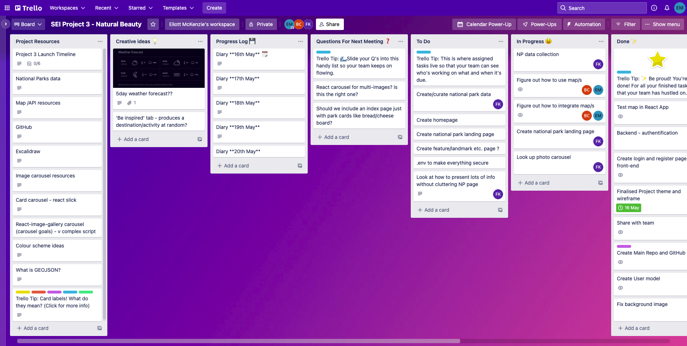
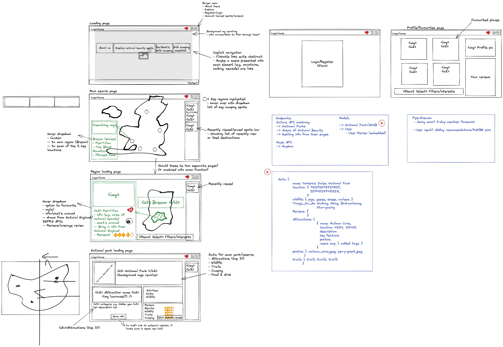

Project 3

# Project Three - Natural Beauty

## The Project Brief

### Group of 3, 1 week

Build a MERN stack application with CRUD functionality. The app must implement React on the front-end and use Express.js on the backend to serve data from a Mongo database. It must also include at least one relationship and reverse relationship on the backend.

## The Idea

I worked on this project with [Fran Knight](https://github.com/fransurf) and [Ben Cave](https://github.com/bens-cave) and created the main git repository here.

The idea was to create an app focused on areas of Natural Beauty in the UK and that allows users to navigate around a map to access information about national parks. We wanted the user to be able to leave reviews and to add their favourite places to come back to on their own profile page.

## Technologies Used

- React
- Node.js
- MongoDB
- Express
- CSS
- Sass
- JSX
- bcrypt
- JWT

## Tools Used

- Git
- Github
- Trello
- Slack
- Excalidraw
- MondoDB Compass

## Our Approach

* We decided to use a Trello board to track our progress and to hold useful links/resources related to the project.



* After brainstorming ideas together we came to the decision that we would like to incorporate a map of some kind into our app so that users can navigate easily through national park related information. After a recommendation we decided to use Mapbox to implement our idea.

This is the wireframe we created. We tried to be as detailed as possible and to take into account what we wanted as MVP and what we could produce as part of a stretch goal. We wanted the national park data to only have Read functionality, so we focused CRUD functionality on other features - reviews and favourites.



**The endpoints that we wanted:**

* Register, login and logout
* To view a user’s profile
* To view all the parks or one single park
* To add a review to a park
* To add parks to the user’s favourites

--------

* Initially we each read through Mapbox documentation and did research to find out how to use a map in our app.

* We then delegated tasks daily. Me and Ben focused on figuring out how to use Mapbox and Fran collated the National Park data for our API. Then Ben focused solely on implementing MapBox.

* Fran worked on collating the data we needed for our API - descriptions, links, images etc - and part of user authentication processes on the front and backend.

### Backend

For the remainder of the project I focused a lot on the backend -

#### Base code

I began by creating the base of our node app with the necessary dependencies. This included installing and importing **express** to handle requests and serve data from our **MondoDB** database. Another of our dependencies was **mongoose** to be able to tranform our MongoDB data into JavaScript object and also to be able to use Schemas for our models.

#### Repo/Git

I also linked this to our main remote repository on GitHub. Throughout the projcet we each worked on our own branch, pushing and pulling to our development branch each day. This was so that if we made mistakes or came across bugs we could easily track our progress and return to different commits if we needed to.

#### Park model and get requests

I defined the schema for a national park [double check with Fran that I actually did this] based off off the keyvalue pairs in the data that Fran had collected so far. Next, I defined two get requests, one to return all the park data, and one to return one park data based on its unique ID generated by MongoDB. Control flow was included in this to handle errors.

#### Seed data

All controllers and routes were added to one router component and I also created seed data and a seed data function so that we could easily return back to our default database after testing post/delete routes. This seed data was updated as Fran collected data throughout the project.

#### Authentication & User model

Then I worked on authentication by defining the user model. Fran added virtual field for `passwordConfirmation` on the register controller, so that its data isn't added to the database. SHe also used custom Pre Validation to check the passwords match, and for security, custom Pre Save alongside `bcrypt` to encrypt (hash) the password before saving it to the database. Seed user data was also added for each of us.

**The user model and its controller**

Displays the user information based on the token generated once they have logged in. A field showing user reviews is also added.

```js
// ? Fields to save to database
const userSchema = new mongoose.Schema({
  username: { type: String, require: true, unique: true, maxLength: 30 },
  email: { type: String, require: true, unique: true },
  password: { type: String, require: true },
  favourites: [{
    parkId: { type: String, required: false },
    name: { type: String, required: false },
    image: { type: String, required: false }
  }]
})
```

(The model also utilises `pre save`, `pre validation`, `toJSON` and `mongooseUniqueValidator` which Fran coded)

After defining the model I was able test the requests in Insomnia as Fran had already coded the auth route controllers - these either add user data via the register route, or check request data against data already in the database using mongoose methods and jwt.

Now that login and register routes worked, I defined a controller to display all the users in the database using the mongoose `find()` function - this was only for development purposes so that I could check that/which users were added. Then I defined a controller to return the logged in user's document using the mongoose `findById()` function. I added the `secureRoute` created by Fran which passes down the logged in user's id through the request body which can be used to find said document. This controller allowed us to later implement a profile page in the front end.

```js
// Method: GET User profile
// Endpoint: /profile
// Description: Show logged in user's profile based on token
export const showUser = async (req, res) => {
  console.log('verfifiedUser ->', req.verifiedUser)
  try {
    // Get profile info
    const profile = await User.findById(req.verifiedUser._id).populate('createdReviews') // add field to show reviews user has posted
    return res.status(200).json(profile)
  } catch (error) {
    console.log(error)
    return res.status(401).json({ message: 'Unauthorised' })
  }
}
```

#### Reviews

We wanted logged in users to be able to add reviews to the national parks, so I worked on this next. The review model is a subdocument that has an embedded relationship with the national park model - this means that if we allowed national parks to be deleted then their reviews would be deleted along with them. I first defined the controller to **post** a review to a national park document. The park's ID is used as a param and the logged in user is added as owner of the review using the `verifiedUser` ID that is passed down through the `secureRoute`.

We wanted the review model to have a reverse relationship with the user model. So I created a virtaul field on the user model that references all the reviews that a user has made.

```js
// ! Reverse relationship
// ? Add virtual field to show reviews user has posted
userSchema.virtual('createdReviews', {
  // Reference the model
  ref: 'Park',
  localField: '_id',
  // Field from reference model containing ID to match localField ID
  foreignField: 'reviews.owner'
})
```

I also defined a controller to carry out a **delete** request to remove a review. We wanted *only* the owner of the review to be able to delete the review so I took the ID generated by MongoDB for the review and used it as a param to find the review on the national park document. Then I was able to check if the `verifiedUser` was the owner of said review using the `equals()` function from mongoose.

[code]
[& show embed relationship]

#### Favourites

The final thing I needed to do on the backend was to find a way for users to be able to add national parks of their choice to a section of their favourites. I initially had trouble figuring out how I could do this. After asking around for help I tried a method of storing favourites in `localStorage` but I found this way unstable as a user would lose this data if they deleted their cookies or signed in on another computer.

Instead I used one controller as a toggle to add or remove a parks ID from a `favourites` array on the user object. I did this by getting the park ID from the request endpoint, as a param, searching the database for this, deconstructing this data to create a new object that is pushed to the `favourites` array on the user's object. I implemented control flow so that if the array already contains the ID, it will be removed, thus making the request a toggle - so both a post and delete route.

**Adding favourites**

Function for adding parks to a user’s `favourites` field:

Rather than creating two functions I created a toggle. I define one function that acts on both a post and a delete endpoint.

```js
// Method: PUT/POST Add To Favourites //! OR remove from favourites
// Endpoint: /profile
// Description: Allow user to add Parks they like to their own list of favourites
// ! ALSO DELETES said park if present in User's profile already <- A Toggle
export const addFavourite = async (req, res) => {
  const { id } = req.params
  try {
    // Find the user through the request body's verified (logged in) user
    let profile = await User.findById(req.verifiedUser._id)

    // Find the park the user wants to add by its ID
    const parkToAdd = await Park.findById(id)

    // Change the ObjectId to a string
    const parkId = parkToAdd._id.toString()

    const newObject = { parkId: parkId, name: parkToAdd.name, image: parkToAdd.parkImg[0] }

    // Check if park is present already in array
    profile.favourites.forEach(favPark => {
      if (favPark.parkId === newObject.parkId) {
        const filteredParks = profile.favourites.filter(favPark => favPark.parkId !== newObject.parkId)
        profile.favourites = filteredParks
      } else {
        profile.favourites.push(newObject)
      } 
    })
    await profile.save()
    return res.status(200).json(profile)
  } catch (error) {
    console.log(error)
  }
}
```

**Endpoint defined in the router:**

```js
// Individual
router.route('/parks/:id')
  .get(getSinglePark)
  .post(secureRoute, addFavourite) // Add a park to user's favourites key
```

### Front-end

#### Login & Register

Using the auth routes from the backend, I allowed users to register and log in to our app. This was done with the use of object states to store information input by the user and a function to track these changes. The input form data could then be sent within an axios request using a submit function connected to an event listener on a button. For the login request I store the token generated by the user in `localStorage` and use this so that we can allow access to different things in our app depending on if the user has logged in or not.

**Login in React**

```js
const Login = () => {

  const navigate = useNavigate()

  // User form data
  const [ formData, setFormData ] = useState({
    email: '',
    password: ''
  })

  // Errors
  const [ errors, setErrors ] = useState(false)

  // Store token to local storage
  const saveTokenToLocalStorage = (token) => {
    window.localStorage.setItem('natural-beauty', token)
  }

  // Update form data
  const handleChange = (e) => {
    setFormData({ ...formData, [e.target.name]: e.target.value })
    setErrors(false)
  }

  // Submit user info to /login endpoint
  const handleSubmit = async (e) => {
    // Prevent page from reloading
    e.preventDefault()
    try {
      // Make post request to /login endpoint
      const { data } = await axios.post('api/login', formData) // formData = request body
      saveTokenToLocalStorage(data.token)
      // Navigate to index page if successful
      navigate('/') // index link here
    } catch (error) {
      // Parse in error messages
      setErrors(true)
    }
  }

  return (
    <>
    <section className="form-page">
        <form onSubmit={handleSubmit}>
          <h1>Login</h1>
          <p>Continue your journey...</p>
          {/* Email */}
          <input type="text" name="email" placeholder="Email" aria-label="Email" required value={formData.email} onChange={handleChange} />
          {/* Password */}
          <input type="password" name="password" placeholder="Password" aria-label="Password" required value={formData.password} onChange={handleChange} />
          {/* Error Message */}
          {errors && <p className="auth-error cent">Unauthorised</p>}
          <button type="submit">Login</button>
        </form>
      </section>
    </>
  )
}
```

**Autheticating the user on the front-end**

```js
// ? Get the token from localStorage
export const getTokenFromLocalStorage = () => {
  return window.localStorage.getItem('natural-beauty')
}

// ? Function to get payload off of token
export const getPayload = () => {
  const token = getTokenFromLocalStorage()
  if (!token) return
  // Split token and return index 1
  const payload = token.split('.')[1]
  // Parse into JSON object
  return JSON.parse(atob(payload))
}

// ? Checking to see if user is autheticated
export const userIsAuthenticated = () => {
  // Get payload for localStorage
  const payload = getPayload()
  // Check payload exists (code will break otherwise)
  if (!payload) return false
  // Get today's date (in milliseconds)
  // Divide by 1000 to convert to seconds, round down
  const currentTime = Math.floor(Date.now() / 1000)
  // Compare token expiry -> expiry needs to be in future to be authenticated
  // Return boolean
  return currentTime < payload.exp
}
```

This checks if the user that is logged in and if the token has expired yet.

#### Profile Page & Favourites

For the profile page I wanted to show the current logged in user's information and an index of all the national parks that they have added to their favourites.

To do this I use a function that gets the token from `localStorage` and send it as an Authorization header in a get request to the /profile endpoint which contains all teh information about the logged in user, including all their favourite places. I was then able to deconstruct the data from this to display within the JSX.

```js
useEffect(() => {
    const getUser = async () => {
      try {
        const { data } = await axios.get('/api/profile', {
          headers: {
            Authorization: `Bearer ${getTokenFromLocalStorage()}`,
          },
        })
        setUser(data)
      } catch (error) {
        setErrors(true)
      }
    }
    getUser()
  }, [])
  ```

#### Navbar

The navbar is coded with Sass and I used the `userIsAuthenticated()` to change which links are displayed depending if the user if logged in or not. If the user is not, Register and Login is displayed, if they are, then they can access their profile or Logout. A function that removes the token from `localStorage` is executed if the user clicks the 'Logout' button, therefore removing access to to things like their profile and favourite functionality.

```js
{userIsAuthenticated() ?
            <>
              <Link to="/profile" alt="Profile">Profile</Link>
              <Link onClick={handleLogout} to="" alt="Logout">Logout</Link>
            </>
            :
            <>
              <Link to="/register" alt="Register">Register</Link>
              <Link to="/login" alt="Login">Login</Link>
            </>
          }
```

* Towards the end of the project we all contributed to the seed data as the amount we needed to collect was a lot

## Challenges/Hurdles

- Getting used to working as a group of 3 and making decisions as a group

- Understanding Mapbox’s documentation and figuring out how to use maps inside our app

- Figuring out how to create a function that allows users to add favourites to their profile

- The ability for a user to add national parks to their favourites list worked initially but a couple hours before presenting, it stopped working. We need to figure out how to fix this bug

- I didn’t manage to finish the code that would allow users to add reviews to parks

## Wins

- Creating working endpoints with controllers

- Creating seed data for national parks and users

- Learning how to work as a group

## Bugs

The favourites function does not work

## Key learnings

- The importance of setting clear goals (even if you feel like they’ll change later on), delegating tasks and recording progress made each day
- That having a stand-up meeting everyday is necessary
- To not let fear of clashing ideas stop me from making suggestions
- Creating a detailed wireframe helps you to keep on track and lessens possible feelings of overwhelm

## Improvements & Stretch Goals

- Fix the bug that stops favourites being added to the user’s profile
- Allow favourites to be added on the map and index pages
- Disable favourites button if a user is not logged in
- Improve styling
- Optimise the app for mobile screens -> make it more responsive
- Finish the function for adding reviews
- Add a function to display an average rating for each national park
- Expand the API to AONBs (Areas of Natural Beauty)
